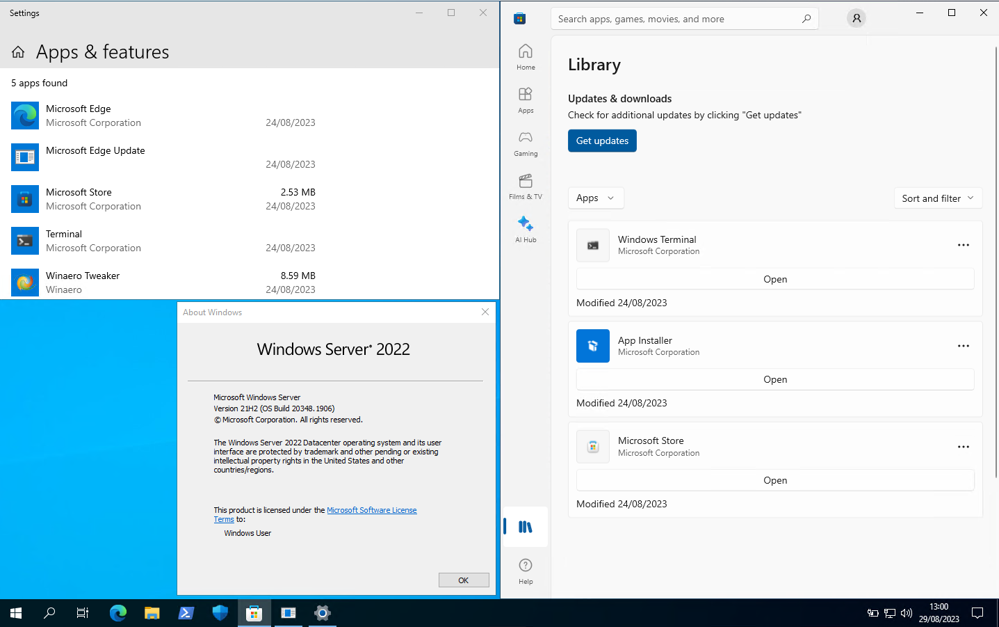

# Windows Server AppxPackage Downloader
<!-- [Github](https://github.com/Jayonics/AppxPackageDependencies) -->

This repository contains PowerShell scripts and modules that can be used to automate the download and installation of the dependencies, package, and license files for:

- Microsoft Windows Terminal
- Desktop App Installer (Winget)
- The Microsoft Store

For use on Windows Server 2022.

The functions within the scripts can also support other Github repos with AppxPackage releases and any Microsoft Store app if required parameter information is provided.

## Core Features

- Wrapper function for downloading AppxPackages from Github via the Github API.
- Wrapper function for downloading AppxPackages from the Microsoft Store via rg-adguard (HTML parsed).
- Automated download and installation of the dependencies, package, and license files for:
  - Microsoft Windows Terminal
  - Desktop App Installer (Winget)
  - The Microsoft Store

## Usage

At the moment there is no streamlined usage of the scripts and modules so extending it's usage will require you to edit the files. However it comes with a pre-configured script that performs an imperative (start-to-finish) install of the prior mentioned apps. The script is called `PackageBundleInstaller.ps1`.

## Known Bugs

- Windows PowerShell attempts to `Invoke-Webrequest` using Internet Explorer's old Internet Options. As Internet Option defaults on Windows Servers are extremely restrictive, you have to painfully add every domain of the rg-adguard site to the trusted sites list when first running the script. This isn't all bad though as a lot are tracking domains. But I will find only the necessary domains for downloading the MSStore packages via rg-adguard and investigate a temporary exclusion of the Internet Options settings for the duration of the script/module.

## Future Improvements

I intend to split the main functions of the script into separate modules and functions so that they can be used in a more modular fashion. While the functions for downloading AppxPackages from both:

- Github
- The Microsoft Store

Using the current functions are flexible enough to download and install any AppxPackage from either, it's still heavily tied into the flow of the main script. I intend to make the functions more modular so that they can be used in a more flexible manner outside the scope of this repo.
